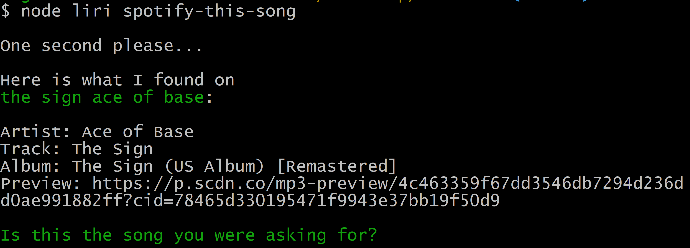

# Liri Bot
'Liri' is a Language Interpretation and Recognition Interface that is accessed through the command line. Liri is powered by several node packages that access the OMDB and Spotify search APIs.

## How it works
The first argument that is sent to Liri after providing ```node``` and ```liri``` will always be the command that you are asking Liri to perform. If you leave this argument blank it will greet you and give you examples of requests.

 


The second argument that is sent to Liri is the information that can give your context to your command. These will typically refer to a _movie_ or _song_.  
  
    
For example, if you wanted to have Liri search Spotify for a song (and artist if provided), you could say ```node liri spotify-this-song <song>```  

 

If you leave the song blank, Spotify will automatically search for the song "The Sign" by _Ace of Base_.  

 

You can also search for a movie using ```node liri movie-this <movie>```  

  

If you leave the song blank, Spotify will automatically search for the song "Mr. Nobody".  

   

You can also ask Liri to do what a random file says. The file contains a preloaded command and query as text and is accessed by Liri through the File System node module.

   

Lastly, you can ask Liri to call you by a specific name when you pass no additional arguments after ```liri```.  

You can utilize this feature by saying ```node liri call-me <your name>```. Liri will save this value for later by using the File System node module.

   


## Access Liri on your machine:
1. Requires node.js (https://nodejs.org/en/download/)
2. Clone this repository into a local directory
3. Move into the Nodemon repository
4. In the command line, type
* This will install all the necessary node modules that this program _depends_ upon.
5. In the command line, type: ```node liri.js``` 
* This will run the Liri application